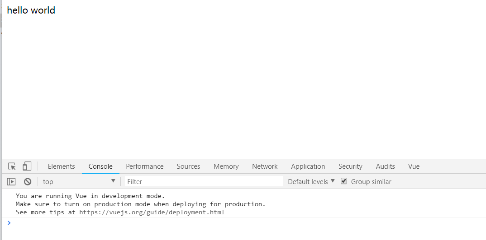
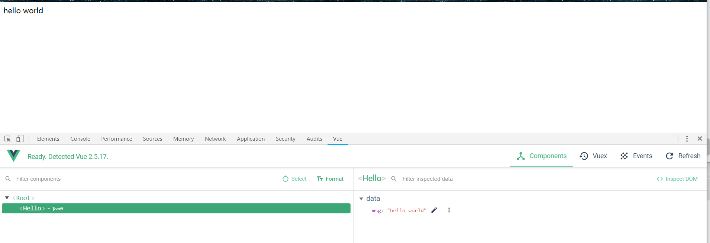

### 说明
使用 `browserify` 尝试搭建一次 `vue` 项目,参考 `vue-cli` 里面 `browserify`配置

### 开始

```bash
  // 安装browserify vue babelify(es6 es7等 转es5)
  npm i -D browserify babelify babel-core babel-preset-env babel-runtime babel-plugin-transform-runtime
  npm i --save vue
```
`babel`这里不多介绍,不了解的请看[这里](https://github.com/zhouzuguang/examples/tree/master/babel-demo)

修改配置

```javascript
  /* package.json */
  "script":{
    "start":"browserify src/main.js -o dist/bundle.js"
  }
  /* packahe.json文件后面  追加browserify 配置,配置babel */
  "browserify":{
    "transform":[
      "babelify"
    ]
  },
  /*   挂载vue */
  "browser": {
    "vue": "vue/dist/vue.common.js"
  },

  /* 新建.babelrc */
  {
    "presets":["env"],
    "plugins":["transform-runtime"]
  }
```

### 编写代码
```javascript
  /* index.html */
  <!DOCTYPE html>
  <html lang="en" dir="ltr">
    <head>
      <meta charset="utf-8">
      <title>browserify-demo</title>
    </head>
    <body>
      <div id="app"></div>
      <script src="./dist/bundle.js"></script>
    </body>
  </html>

  /* src/components/Hello.js */
  /*  Hello 组件 */
  export default {
    template:'<div>hello world</div>'
  }

  /* src/main.js */
  import Vue from 'vue'
  import Hello from './components/Hello'

  new Vue({
    el:'#app',
    components:{
      Hello
    },
    template:'<Hello />'
  })

```
项目结构如下：

```bash
|-- browserify-demo
|   |-- node_modules
|   |-- dist
|   |   |-- bundle.js
|   |-- src
|       |-- components
|           |-- Hello.js
|       |-- main.js
|   |-- img
|   -- babelrc
|   -- index.html
|   -- package.json
|   -- README.md
```
执行 `npm start`,然后打开index.html 即可看到效果


### 单组件文件
这里希望使用`.vue`这种形式来写`Vue`的应用,这里需要安装`vueify`
```bash
  npm i -D vueify
```

修改配置
```javascript
  /* package.json */
  "browserify":{
    transform:[
      "babelify",
      "vueify"
    ]
  }
```
修改代码
```javascript
    /* 删除  src/components/Hello.js */
    /* src/components/Hello.vue */
    <template >
      <div >
        {{ msg }}
      </div>
    </template>

    <script>
    export default {
      data () {
        return {
          msg:'hello world'
        }
      }
    }
    </script>

    /* src/main.js */
    import Vue from 'vue'
    import Hello from './components/Hello.vue'

    new Vue({
      el: '#app',
      components: {
        Hello
      },
      template: '<Hello/>'
    })

```

重新执行 `npm start`,效果如下：


### 热更新
希望开发的时候,代码有改动,浏览器自动刷新,需要用到`watchify` `browserify-hmr` `http-server` `npm run all`
```bash
  npm i -D watchify browserify-hmr http-server npm run all
```
修改配置
```javascript
  /* package.json */
  "scripts": {
    "watchify": "watchify -vd -p browserify-hmr -e src/main.js -o dist/bundle.js",
    "serve": "http-server -o -c 1 -a localhost",
    "dev": "npm-run-all --parallel watchify serve"
  }
```
执行`npm run dev`,即可完成。

`npm-run-all`:`window`上无法使用 `&` 执行多条命令,这个包 相当于 `&`功能

`http-server`:启动一个服务器,
-o :打开浏览器
-c 设置缓存, -c 1 即 缓存 1秒

`watchify`:封装了`browserify`,监听代码变动,有修改则会更新生成的代码。-v：显示详情, -d:debug, -p:使用插件, -e:入口文件 -o:生成文件

`browserify-hmr`:热更新
### 打包
```bash
  npm i -D cross-env envify uglify
```
`cross-env`:设置环境变量

`envify`: uglify 一起使用，移除所有的调试代码和详细的错误信息，以此来提升效率并缩减文件体积。

`uglify`: 代码压缩

修改配置
```javascript
  /* package.json */
  "script":{
    "watchify": "watchify -vd -p browserify-hmr -e src/main.js -o dist/bundle.js",
    "serve": "http-server -o -c 1 -a localhost",
    "dev": "npm-run-all --parallel watchify serve",
    "build": "cross-env NODE_ENV=production browserify -g envify -p [ vueify/plugins/extract-css -o dist/bundle.css ] -e src/main.js | uglifyjs -c warnings=false -m > dist/bundle.js"
  }
```
执行`npm run build`即可打包代码

### 心得
browserify 配置`vue`项目相比`webpack`简单一点,主要是学习各个npm包的使用,使用到的npm包确实挺多的,一个一个查看理解也是很耗费时间的。`browserify` + `gulp` 可以实现更复杂的任务,找个时间研究一下。

### 文档
> - [browserify](https://github.com/browserify/browserify)
> - [vueify](https://www.npmjs.com/package/vueify)
> - [browserify-hmr](https://www.npmjs.com/package/browserify-hmr)
> - [watchify](https://www.npmjs.com/package/watchify)
> - [http-server](https://www.npmjs.com/package/http-server)
> - [npm-run-all](https://www.npmjs.com/package/npm-run-all)
> - [cross-env](https://www.npmjs.com/package/cross-env)
> - [envify](https://www.npmjs.com/package/envify)
> - [uglify](https://www.npmjs.com/package/uglify)
