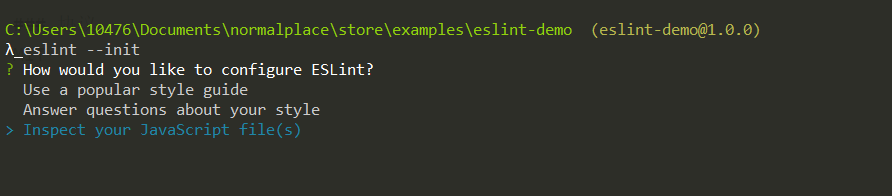
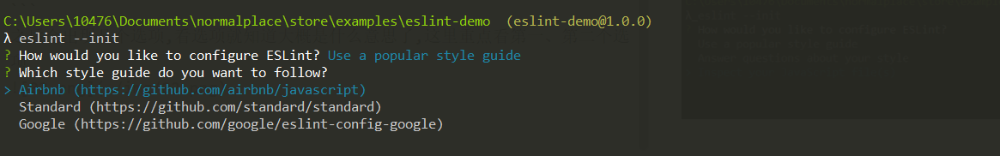
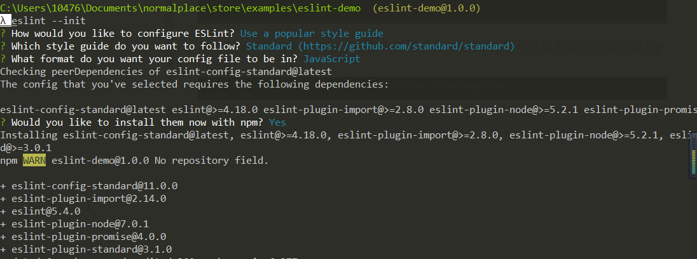
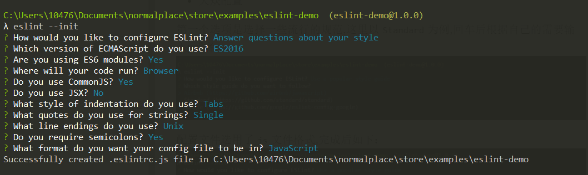
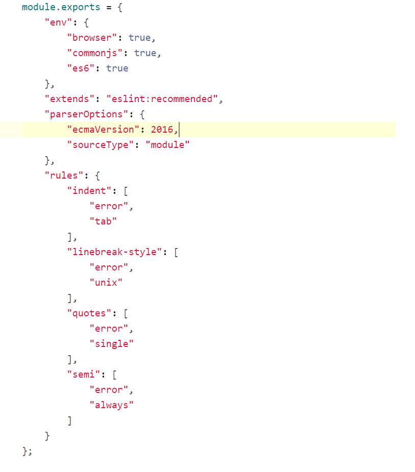

### 开始
```bash
    // 安装 eslint
    // 局部安装
    npm i --save-dev eslint
    // 或者全局安装
    npm i -g eslint
```
### 使用
```bash
    eslint --init
```

之后会出现几个选项,看选项就知道大概是什么意思了,这里重点看第一、第二个选项


- 大众配置

第一个选项是选择一些流行的规范,这里以`Standard`为例,回车后根据自己的需要输入y或者n


配置文件选用了`js`文件格式,完成后如下：


[配置规则-English](https://github.com/standard/standard)
[配置规格-中文](https://github.com/standard/standard/blob/master/docs/README-zhcn.md)

- 自定义配置

根据自己的需要,输入y/N,如下

得到的配置文件如下:


之后你可以往里面继续添加自己的规格,详情请看[eslint官网](https://eslint.org/)

### 心得
直接使用一些大众的规则就好了,不需要自己再配置,以后团队协作也很方便,直接使用一些大众的规则就好了,不需要自己再配置,以后团队协作也很方便,而且编辑器里面大部分都会有插件支持这些大众规则的。
