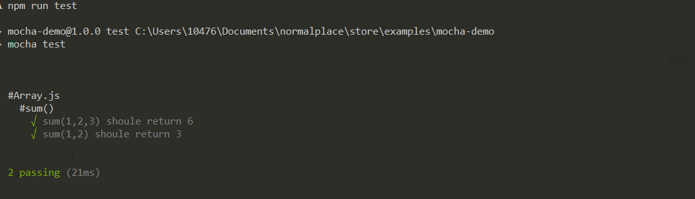

### 开始
```bash
  npm i -D mocha
```
### 编写代码

```javascript
  // 编写代码 新建src/Array.js
  function sum(...res) {
    let sum = 0
    for (let i = 0; i < res.length; i++) {
      sum += res[i]
    }
    return sum
  }
  exports.sum = sum

```

测试代码
```javascript
  // 编写测试代码 新建test/Array.test.js
  const assert = require('assert')
  const { sum } = require('../src/Array')

  describe('#Array.js', () => {
    describe('#sum()' () => {
      it('sum(1, 2, 3) should return 6', () => {
        assert.strictEqual(sum(1, 2, 3), 6)
      })

      it('sum(1, 2) should return 3', () => {
        assert.strictEqual(sum(1, 2), 3)
      })
    })
  })

```
### 测试
```bash

  mocha test

  /*
   * 或者写入到 node script里面,修改package.json
   *  "scripts": {
   *   "test": "mocha test"
   *  },
   * 然后 npm run test 即可
   */

```



### 心得
mocha的初体验，以后在项目中慢慢体会吧！

### 文档
>[Mocha](https://mochajs.org/)
